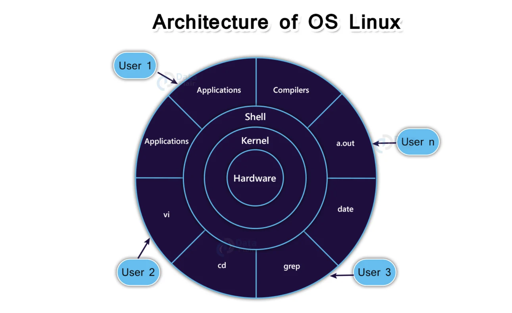

## Въведение

**Операционната система** е софтуер, който управлява хардуерът и ресурсите на един компютър. Тя позволява на приложенията да взаймодействат с хардуера. Популярни операционни системи са Windows, Linux  MacOS. <br />

**Unix** е multitasking, мултипотребителна операционна система разработена през 60-70те години на миналия век.(Developed in 1969, Recoded almost entirely in C by 1973). <br />

**Unix-базираната операционна система** е ОС, която е създадена по подобие на Unix. Терминът се използва за общо название на ОС, които наподобяват оригиналния Unix. Примери за Unix-базирани операционни системи са Linux и MacOS. 

**Linux (или GNU/Linux)** е семейство от на Unix-подобни операционни системи основаващи се на ядрото „Linux“ и системните инструменти и библиотеки от проекта GNU.  

**Linux дистрибуция** е операционна система съставена от Linux ядро, GNU библиотеки, допълнителен софтуер и package manager. 

**Ядрото** е основната част на операционната система. То взаимодейства с хардуера, управляващ различни компоненти като процесора, периферните устройства и паметта.

**Командният интерпретатор (shell)** осигурява връзката между потребителя и ядрото на операционната система. Toй приема потребителски команди през терминала и обработва конкретната заявка. Най известните командни интерпретатори са bash, sh, zsh и други. <br />
Utilities са помощни програми, които предоставят на потребителя повечето функции на операционните системи. <br />



**Програма**:
- Дефиниция: Програмата е статичен набор от инструкции и данни, записани на диск или в друг носител, които могат да бъдат изпълнени от процесора.
- Основни характеристики:
    - Това е пасивна съвкупност от инструкции.
    - Представлява файл на твърдия диск (например .exe, .sh, .py).
    - Не се изпълнява, докато не бъде заредена в паметта и стартирана.
    - Може да бъде еднократно или многократно стартирана, като всяко стартиране създава нов процес.

**Процес**:
- Дефиниция: Процесът е активен екземпляр на програма, която се изпълнява в даден момент от операционната система.
- Основни характеристики:
    - Това е активно изпълнение на инструкциите от програмата.
    - Процесът се създава, когато програма се зареди в оперативната памет и започне изпълнението.
    - Всеки процес има собствена среда за изпълнение:
        - Собствено адресно пространство в паметта.
        - Собствен набор от системни ресурси (CPU, памет, файлове и т.н.).
        - Процес идентификатор (PID) – уникален номер за идентификация.
    - Един процес може да създаде други процеси, наречени дъщерни процеси.

| **Характеристика**         | **Програма**                        | **Процес**                                |
|----------------------------|-------------------------------------|------------------------------------------|
| **Състояние**               | Пасивна (статичен файл)             | Активна (изпълняваща се програма)         |
| **Съхранение**              | На диск или друг носител            | В оперативната памет                     |
| **Идентификация**           | Няма идентификатор                  | Има уникален PID                         |
| **Ресурси**                 | Не използва ресурси                 | Използва ресурси (CPU, RAM, файлове)     |
| **Взаимодействие с ОС**     | Не участва в управление от ОС       | Участва активно в управлението от ОС     |
| **Множество екземпляри**    | Една програма може да се стартира многократно | Всеки екземпляр създава нов процес      |

**Файл**:
- Дефиниция: Файлът е основна единица за съхранение на данни в компютърните системи. Това е логическа структура, която съдържа информация, като текст, изображения, аудио, видео или други данни.
- Характеристики:
    - Има име и разширение (например document.txt, където txt указва типа на файла).
    - Съдържа данни в определен формат.
    - Файловете могат да бъдат от различни видове
        - текстови
        - двоични
        - изпълними
        - други.
    - Съхранява се на устройства за дълготрайно съхранение (твърди дискове, SSD, USB памети и т.н.).

**Директория:**
Дефиниция: Директорията (папка) е логическа структура, използвана за организиране и управление на файлове и други директории(поддиректории).
- Характеристики:
    - Може да съдържа файлове и/или други директории.
    - Позволява йерархична организация на данните, улеснявайки навигацията и достъпа.
    - Има име, което помага за идентифицирането ѝ (например Documents, Music).
    - Основната директория в операционната система се нарича коренна директория (root directory), обозначена с `/` в UNIX-базирани системи или с буква на устройство (например `C:\`) в Windows.
        - В Windows няма обща директория, която да обединява всички устройства (например над `C:` или `D:`). Вместо това, Windows използва независими коренни директории за всеки драйв (C:\, D:\) и ги представя визуално като отделни обекти в This PC.

| **Характеристика**         | **Файл**                        | **Директория**                           |
|----------------------------|---------------------------------|------------------------------------------|
| **Предназначение**         | Съхранява данни                 | Организира файлове и поддиректории       |
| **Съдържание**             | Данни в определен формат        | Пътища към файлове или други директории  |
| **Пример**                 | document.txt                    | C:\Users\Documents                       |

**Специалната директория Root**:
- Дефиниция: Root (от англ. "корен") е най-горното ниво в йерархията на файловата система на операционната система. Това е основната или "коренната" директория, от която започва цялата структура на файловата система.
- Характеристики:
    - Начална точка
        - Всички файлове и директории в системата произлизат от root директорията.
        - Root служи като родител на всички други директории.
    - Маркировка в различните системи:
        - В UNIX/Linux системи:
            - Root директорията се обозначава със символа `/`
            - Например: `/home`, `/etc`, `/var` са поддиректории на `root`.
        - В Windows системи:
            - Root директорията се обозначава с буква на устройство, последвана от двоеточие и наклонена черта (например C:\).
            - Всяко устройство има своя собствена root директория (напр. D:\).
    - Достъпност
        - Root директорията обикновено изисква административни права за директно модифициране (особено в UNIX/Linux).
        - В системи с много потребители root е защитена, за да предотврати неволни промени.
    - Съдържание
        - Root съдържа важни системни директории и файлове.
        - Например:
            - в LINUX: `/bin`, `/etc`, `/home`, `/var` и други.
            - в Windows: `C:\Windows`, `C:\Program Files`, `C:\Users` и други.

В UNIX/Linux, термина root се използва не само за директория, но и за root потребителя:
- Root потребител: Администраторски акаунт с пълен достъп до всички части на системата.
- Root директорията (/) е пряко достъпна за този потребител.

## Файлова структура 
В Линукс всичко е файл или процес. <br />
Файловете се групират в директории, които могат също така да съдържат други поддиректории и така се сформира дървовидната файлова структура. <br />
Коренът на това дърво се нарича **главна директория** (root directory) и се бележи с наклонена черта `/`. <br />
Първоначално като се логнем ние се намираме в нашата начална потребителска директория. <br />

Всяка директория (без главната) съдържа два скрити "указателя". 
- `.` - указател към текущата директория
- `..` - указател към родителската директория на текущата директория

### Абсолютен vs относителен път
**Абсолютният път/Absolute path** указва точното местоположение на файл или директория в структурата на файловата система, като започва от root (`/`)директорията. Това е пълен път, който не зависи от текущата директория.
- Винаги започва от root (/ в UNIX/Linux или C:\ в Windows).
- Показва пълната йерархия от root до целевия файл/директория.
- Работи независимо от текущата директория.
- Примери:
```
Linux/UNIX: /home/user/documents/file.txt
Windows: C:\Users\UserName\Documents\file.txt
```

**Относителен път/Релативен път/Relative Path** указва местоположението на файл или директория от текущата директория (working directory). Той е относителен към позицията, в която се намираш в момента.
- Не започва от root.
- Може да използва специални обозначения:
    - `.`  : текущата директория.
    - `..` : родителската директория.
- По-кратък и гъвкав, но зависи от текущата директория.
- Примери:
```
// Ако текущата директория е /home/user
documents/file.txt (отнася се до /home/user/documents/file.txt)
../shared/file.txt (отнася се до /home/shared/file.txt)
```

**Кога да използваме кой тип?**
- Абсолютен път
    - Когато искаш да осигуриш точност и да избегнеш зависимости от текущата директория.
    - Подходящ за скриптове или конфигурационни файлове, които трябва да работят независимо от контекста.
- Релативен път
    - Когато искаш гъвкавост, особено при работа с проекти, където файловете са организирани в относителна структура.
    - Полезен за бърза навигация в командния ред.

## Сигнатура на командите
```
cmd [-oпции] [аргументи]
```
Като най-добрия ви приятел по ОС e `man` командата. Тя ви дава информация за всяка команда и нейните опции. 
За да излезем от man натискаме клавиша `q`.

**Man section:**
1. Executable programs or shell commands
2. System calls (functions provided by the kernel)
3. Library calls (functions within program libraries)
4. Special files (usually found in /dev)
5. File formats and conventions (Eg: /etc/passwd)
6. Games
7. Miscellaneous
8. System administration commands (usually only for root)
9. Kernel routines (non standard)

Start specific search with /
Cancel search with CTRL+C

```
/(--)[a-Z]
```

```
  ?    for zero or one of the preceding expression
  *    for zero or more of the preceding expression
  +    for one or more of the preceding expression

Eg: (for two or more dashes).
(--)+
```

```
man cmd
foo --help, foo -h
```

## Команди за навигиране във файловата система
1. `cd` - чрез cd сменяме директорията.
    - Можем да направим това чрез относителен или абсолютен път до директорията.
    - `cd` без аргумент ни води към началната ни потребителска директория
    -  If directory is not supplied, the value of the `HOME` shell variable is used;

```
cd [directory]
cd [directory_name] 

cd / //change to root directory

cd ~ //change to home directory
cd // change to home directory - same as cd ~

cd .. //move to parent directory, move one directory up
cd - //move to parent directory, move to prev directory

cd “dir name” //navigate to directory with white spaces
cd dir1/dir2/dir3 //move inside a directory from a directory 
```

## Информационни команди
1. `ls` - тази команда без аргументи ни дава съдържанието на текущата директория (само имената на файловете). Също така, ако искаме да видим съдържанието на друга директория без да сменяме текущата можем да направим `ls [-опции] dirpath`. 
Oпции, които ще използваме:
    - `-l` подрежда файловете в списък, като ни дава и повече информация за файловете. 
    - `-a` извежда освен всички файлове и скритите (скритите са тези с точка пред името си)
    - `-lh` извежда информацията за файловете в human-readable format

    ```
    # Command
    ls -la

    # Output
    drwx------   3 s62226 students  4096 Mar 19 15:25 .
    drwxr-xr-x 333 root   root     12288 Mar 13 13:24 ..
    -rw-------   1 s62226 students   185 Mar 19 15:41 .bash_history
    -rw-r--r--   1 s62226 students   220 Apr 18  2019 .bash_logout
    -rw-r--r--   1 s62226 students  3243 Sep  3  2022 .bashrc
    -rw-r--r--   1 s62226 students  4423 Sep  3  2022 .dircolors
    -rw-r--r--   1 s62226 students  2078 Dec  9  2020 .kshrc
    -rw-r--r--   1 s62226 students   807 Apr 18  2019 .profile
    drwxr-xr-x   3 s62226 students  4096 Mar 19 15:25 .vscode-server
    ```

    След като изпълним `ls -l` в първата колона се появяват правата за достъп на файла:
      - На първата позиция имаме `-` или `d`,  което съответно ни индикира, че това е файл или директория.
      - Следващите три тройки от символи съответно ни индикират правата за четене ( r ), писане ( w ) и изпълнение ( x ) за текущия потребител, групата, в която се намира и останалите потребители. Ако някое право е забранено съответно на мястото му присъства `-`.

      ```
      ls [flags] [directory]
      ls / //list root directory
      ls ~ //list contents of user home directory
      ls .. //list files in the parent directory
      ls -d //list only directories
      ls * //list content of directory with it's subdirs
      ls -R //recursive = all files&dir + their subdirs
      ls -s //list content with their sizes
      ls -S //list files and sort by size
      ls -l //list in long format
      ls -lh //list files in long format with readable file sizes
      ls -a //list files including hidden files
      ```
2. `pwd` - дава абсолютния път на директорията, в която се намираме в момента. 

3. `date` - дава ни системната дата.
```
date
Fri Jan 26 12:00::28 PM EET 2024
```
- `-I` - output date & time in ISO 8601 format. (Example output: 2024-05-18);
- `date +'%Y-%m-%d %H:%M:%S` - is used to format and display the current date and time in a specific format:
    - `%Y`: The year with century as a decimal number (e.g., 2024);
    - `%m`: The month as a decimal number (01-12);
    - `%d`: The day of the month as a decimal number (01-31);
    - `%H`: The hour (24-hour clock) as a decimal number (00-23);
    - `%M`: The minute as a decimal number (00-59);
    - `%S`: The second das a decimal number (00-59);

4. `cal`
	- Принтира календар
	- без аргументи принтира текущия месец
	- `cal [месец] [година]` - принтира месеца и годината, които сме задали
	```   
    cal 02 2024
        February 2024
    Su Mo Tu We Th Fr Sa
                1  2  3
    4  5  6  7  8  9 10
    11 12 13 14 15 16 17
    18 19 20 21 22 23 24
    25 26 27 28 29
	```

5. `du [-опции] [файл/директория] `
	- показва дисково пространство, заето от файлове или директории.
	- без указан файл/директория показва заеманото дисково пространство на всички файлове, директории и поддиректории на текущата директория в която се намиране
	- Options:
		- `-a` показва информацията и за скритите файлове
		- `-h` показва размера в human readable format
		- `-s` показва **само** размера на подадената директория
    - `-P` използва POSIX format  

6. `df [oпции] [файл]`
	- показва кратка информация за заеманото дисково пространство на файловата система 
	- ако бъде специфициран файл то то се показва информация за файловата система, в която се намира той 
	- Options:
		- `-h` показва размерите в human readable format
		- `-k`  показва размерите в килобайти
		- `-m`  показва размерите в мегабайти
		- `-h` показва размерите в гигабайти 

7. `tty`  -  показва името на файла на терминала, свързан към стандартния вход.

8. echo (output/print)
    - `echo "some nice string"`  - принтира на терминала текста в кавичките
    - `echo -n "some nice string"` - прави същото, но не поставя нов ред (т.е. промп-та ще се залепи след това в кавичките)
    - `echo -e "first line\nsecond line"` - разрешава интерпретацията на backslash escapes (като \n, \t etc)

## Комуникация между потребители
1. `who` - показва информация за логнатите потребители
	- Първата колонка показва потребителското име. 
	- Втората колонка показва терминала, на който е логнат потребителя.
	- Третата колона дава ден и час на логина. 
	- Евентуално има и четвърта колона, която показва IP-то, ако не сме локално логнати. 
	- Options:
		- `-u` дава повече информация за логнатите потребители -  ако потребителят е бил активен в последната 1 минута се появява . в предпоследната колонка, a иначе изписва преди колко време е работил последно. В последната колонка се показва процеса, с който е свързан логина ни.
		- `-T` във втората колонка, след името на потребителя, ако е разрешил получaване на съобщения се появява + във втората колонка, иначе е -;
		- `-H` - дава хедърите на колонките
- `who am i` - същото като who, но показва информация само за текущия потребител
- `whoami` - показва името на потребителя, изпълнил командата
- `w` - показва информация за логнатите потребители и какво правят в момента
- `wall` - пишем съобщение до всички
- `mesg [y|n]`
	- разрешава/забранява получаването на съобщения от други потребители 
	- без аргументи, командата показва информация дали сме разрешили или забранили съобщения
	- Options: 
		- `mesg y` - разрешава съобщения
		- `mesg n` - забранява съобщения  
- `write [user] [tty]` - пишем съобщение до даден user като можем да укажем и по кой терминал да му се прати, ако user-a е логнат в повече от един. Ако потребителя е забранил съобщенията си излиза грешка.
