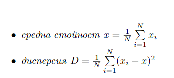

# 2019-SE-01

В приложната статистика често се използват следните описателни статистики за дадена извадка:

{x1, x2 , ... , xN } са стойностите на извадката, а N е техния брой.  

Напишете програма на C, която приема задължителен параметър – име на двоичен файл.  
Файлът съдържа информация за потребители, които са влизали в системата, и се състои от наредени петорки от следните елементи и техните типове:  

- уникален потребителски идентификатор (UID) uint32_t
- запазено1 uint16_t – не се използва в задачата
- запазено2 uint16_t – не се използва в задачата
- време1 uint32_t – момент на започване на сесията (Unix time)
- време2 uint32_t – момент на завършване на сесията (Unix time)

За потребители, които са имали сесии, квадратът на продължителността на които е по-голям от дисперсията D на продължителността на всички сесии във файла, програмата трябва да изведе на STDOUT потребителският им идентификатор и продължителността на най-дългата им сесия.
Можете да разчитате на това, че във файла ще има не повече от 16384 записа и че в тях ще се срещат не повече от 2048 различни потребителски идентификатора.