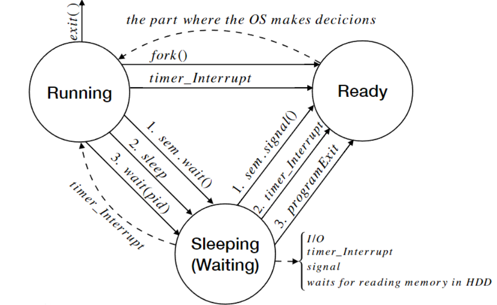
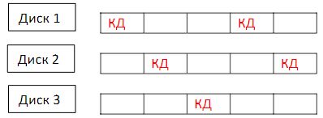

# Tема 1

## Въпрос:
Опишете как ОС разделят ресурсите на изчислителната система, дайте примери за основните типове разделяне:
- разделяне на пространството (памети);
- разделяне на времето(процесори, други у-ва);

Опишете с по едно-две изречения работата на следните системни извиквания в стандарта POSIX:
- pipe();
- dup2();
- fork();
- exec();
- wait();
- waitpid();

## Отговор/Решение:
### Разделяне на пространството (памети)
Когато един процес работи, неговите данни и стек трябва да бъдат монополна собственост, тоест никой друг процес да няма достъп до тях. <br />
Тази защита се осигурява чрез хардуерни механизми в процесора и операционната система. <br />

Съществуват два основни режима на работа:
- Kernel mode (ядрото, привилегирован достъп)
    - Процесът има пълен достъп до паметта, хардуерните ресурси и привилегировани инструкции.
    - Обикновено операционната система работи в този режим.
-  User mode (обикновен процес, ограничен достъп)
    - Процесът има достъп само до своята адресна памет и може да използва определен набор от инструкции.
    - При нужда от достъп до системни ресурси, процесът прави системно извикване (syscall), което превключва изпълнението в kernel mode.


Има два основни начина за разделяне на паметта между процесите:
- Сегментация
    - при този метод паметта е разделена на логически сегменти (код, данни, стек), всеки от които има монополна собственост върху определена област от адресното пространство.
    - всеки сегмент има собствена база (начален адрес) и лимит (размер).
    - Процесорът проверява всеки адресен достъп, за да гарантира, че е в позволените граници.
    - Примерно, за даден сегмент имаме два регистъра:
        - Base – начален адрес на сегмента
        - Limit – размер на сегмента
        - Преди достъп до паметта, операционната система проверява дали адресът попада в [Base, Base + Limit).
- Paging
    - При страницирането паметта се разделя на фиксирани блокове с еднакъв размер, наречени страници.
    - Виртуалната памет на всеки процес има монополна собственост върху своето виртуално адресно пространство, но реалното му разположение се управлява от операционната система.
    - Структурата на адресното пространство:
        - Виртуална адресна памет: Съдържа виртуални страници, които имитират RAM за всеки процес.
        - Физическа памет (RAM): Страниците на процеса могат да бъдат разположени навсякъде в оперативната памет или дори на диск (swap).
        - Таблица на страниците: Съхранява реалните физически адреси на виртуалните страници.
        - Ако дадена страница не се намира в RAM (page fault), тя може да бъде заредена от диска, като по-рядко използваните страници се разместват (paging in/out).

### Разделение на процесорно време
Разпределението на процесорното време между процесите е ключова задача на операционната система. Всеки процес има монополна собственост върху процесорното време, което му е разпределено, но операционната система управлява кога и колко време всеки процес получава. <br />

Процесите могат да бъдат класифицирани според начина, по който използват процесора:
- I/O-bound процеси
     -Прекарват повече време в чакане на входно-изходни операции (например четене от диск, мрежови заявки).
     - Тези процеси често се блокират, докато чакат външни ресурси, и трябва бързо да получат процесорно време, когато станат готови за изпълнение.
- CPU-bound процеси
    - Интензивно използват процесора за изчисления, без да извършват чести входно-изходни операции.
    - Тези процеси могат да бъдат изпълнявани за дълги периоди от време, но нямат строги времеви изисквания.
- Real-time процеси
    - Трябва да завършат задачите си в строго определени времеви рамки.
    - Soft real-time (меко реално време)
        - Допуска се малко закъснение, но е желателно задачите да се изпълняват в срок (например обработка на видео или аудио потоци).
    - Hard real-time (твърдо реално време)
        - Процесите трябва стриктно да спазват зададените времеви ограничения (например вградени системи за медицински устройства, авиация и индустриална автоматизация).

Методи за разпределение на процесорното време. <br />
Операционната система използва различни алгоритми за планиране на процесите, като един от най-простите е **Round-robin**:
- Всеки процес получава фиксиран времеви отрязък (time slice, quantum), след което процесорът се превключва към следващия процес.
- Процесите се подреждат в опашка FIFO (First In, First Out), като никой процес няма абсолютен приоритет пред друг.
- Предотвратява се гладуване (starvation), но I/O-bound и реално-времевите процеси може да не получават достатъчно бързо достъп до процесора.

Съвременните операционни системи използват по-сложни методи за управление на приоритетите:
- Динамични приоритети
    - Когато процес чака твърде дълго за процесорно време, неговият приоритет се увеличава, за да бъде изпълнен по-скоро.
- Отнемане на приоритет
    - Процесите започват с еднакъв приоритет, но колкото повече процесорно време използват, толкова повече приоритетът им намалява.
Тези механизми позволяват ефективно разпределение на процесорното време между различните типове процеси, като се балансира между интерактивност и производителност.

### Posix commands:
- pipe()
    - Създава анонимна комуникационна тръба между два свързани процеса.
    - Приема масив от два файлови дескриптора: fd[0] за четене и fd[1] за писане.
    - Използва се за междупроцесна комуникация (IPC).
- dup2()
    - Създава копие на файлов дескриптор, подаден като първи аргумент и го записва на номера на файлов дескриптор, подаден като втори аргумент.
    - Ако вторият файлов дескриптор е отворен, той първо бива затворен преди да бъде използван повторно.
- fork()
    - Създава нов процес (дете), който е копие на родителския.
    - Детето наследява отворените файлове и паметта, но има уникален процесен идентификатор (PID).
    - Връща 0 на детето и PID на детето на родителя.
- exec()
    - заменя изпълнимия код на текущия процес с нова програма.
    - Съществуват различни варианти (execl, execp, execv и др.), които приемат различни начини за подаване на аргументи.
    - При успешно изпълнение, старият процес вече не съществува.
- wait()
    - Блокира текущия процес, докато някое от неговите деца не приключи изпълнението си.
    - Връща PID на завършилия процес и може да запази информация за статуса му.
- waitpid()
    - Подобно на wait(), но изчаква конкретен процес, идентифициран по PID.
    - Позволява повече контрол, като може да не блокира (WNOHANG) или да изчака само определени типове събития.

# Teма 2

## Въпрос:
Опишете разликата между времеделене и многозадачност. <br />
Какви ресурси разделя еднозадачна, еднопотребителска ОС? <br />

Опишете с по едно-две изречения работата на следните системни извиквания в стандарта POSIX:
- оpen();
- close();
- read();
- write();
- lseek();

## Oтговор/Решение:

### Времеделение
Времеделение наричаме техниката за разпределяне на процесорното време между множество процеси чрез кратки времеви отрязъци (time slices). Това позволява на няколко потребители да работят с един процесор, като се създава илюзията, че всеки има отделен процесор.

### Многозадачност
Многозадачността е способността на операционната система да изпълнява множество задачи едновременно чрез превключване на процеси. Тя може да бъде:
- Кооперативна многозадачност – процесите сами отстъпват управлението на процесора.
- Принудителна (preemptive) многозадачност – Операционната система разпределя времето динамично, като прекъсва процесите и превключва контекста.

### Разлика между времеделене и многозадачност
Времеделението е механизъм за разпределение на процесорното време, който позволява многопотребителски достъп до системата, като всеки процес получава малък времеви отрязък. <br />
Многозадачността е по-широк термин, който означава способността на ОС да изпълнява множество задачи чрез превключване на процеси, независимо дали е еднопотребителска или многопотребителска среда.

### Eднозадачна потребителска ОС
Еднозадачната еднопотребителска ОС позволява на един потребител да изпълнява само една задача в даден момент.
Тя заема по-малко памет и ресурси, но не поддържа многозадачност. Пример за такава система е MS-DOS.

### Posix commands:
- open()
    - Отваря (или създава) файл с име, подадено като аргумент. Връща като резултат стойността на файловия дескриптор, асоцииран с този файл, а при грешка връща -1.
- close()
    - Затваря файл, идентифициран чрез файловия дескриптор, и освобождава свързаните с него ресурси.
- read()
    - Чете данни от файл, като приема файлов дескриптор, буфер и размер на данните за прочитане. Опитва се да прочете съответния брой байтове от файловия дескриптор и да ги запише в буферa.
- write()
    - Записва данни във файл, като приема файлов дескриптор, указател към буфер и размер на записваните данни. Връща броя на записаните байтове.
- lseek()
    - Премества указателя за четене/писане в даден файл на нова позиция.

# Teма 3

## Въпрос:
Дайте кратко определение за:
- многозадачна ОС
- многопотребителска ОС
- времеделене

Опишете разликата между многопотребителска и многозадачка работа. <br />
Какви качества на ОС характеризират тези две понятия? <br />

Опишете с по едно-две изречения работата на следните системни извиквания в стандарта POSIX:
- open();
- close();
- lseek();
- pipe();
- dup2();

## Отговор/Решение:
### Многозадачност
Многозадачността е способността на операционната система да изпълнява множество задачи едновременно чрез превключване на процеси. Тя може да бъде:
- Кооперативна многозадачност – процесите сами отстъпват управлението на процесора.
- Принудителна (preemptive) многозадачност – Операционната система разпределя времето динамично, като прекъсва процесите и превключва контекста.

### Многопотребителската oперационна система
Операционна система, която позволява на множество потребители да работят с нея едновременно, като управлява достъпа им до ресурси, процеси и файлове. <br />
Тя планира ефикасното използване на ресурсите на системата и може да съдържат специализиран софтуер за изчисление на процесорното време от много потребители, както и да отчита използваната памет и ресурси. <br />

### Времеделение
Времеделение наричаме техниката за разпределяне на процесорното време между множество процеси чрез кратки времеви отрязъци (time slices). Това позволява на няколко потребители да работят с един процесор, като се създава илюзията, че всеки има отделен процесор

### Разлика между многопотребителска и многозадачна работа:
Разликата между многопотребителска и многозадачна операционна система е, че при многозадачната ОС имаме един потребител, който едновременно изпълнява няколко задачи. <br />
При многопотребителската система имаме множество от потребители, всеки от които  изпълнява  някакви  задачи,  като  се  предоставя  възможност  на  всеки  от потребителите да работи, като по този начин изглежда, че за всеки потребител има 
отделно ядро, което всъщност не е така. <br />

### POSIX системни извиквания:
- open()
    - Отваря файл и връща файлов дескриптор, който се използва за последващи операции като четене и писане.
    - Позволява задаване на права за достъп и режими на отваряне (например само за четене, само за писане, добавяне и т.н.).
- close()
    - Затваря отворен файл, идентифициран чрез файловия му дескриптор, и освобождава свързаните с него ресурси.
- lseek()
    - Премества указателя за четене/писане в даден файл на нова позиция.
- pipe()
    - Създава анонимна комуникационна тръба между два свързани процеса.
    - Приема масив от два файлови дескриптора: fd[0] за четене и fd[1] за писане.
    - Използва се за междупроцесна комуникация (IPC).
- dup2()
    - Създава копие на файлов дескриптор, подаден като първи аргумент и го записва на номера на файлов дескриптор, подаден като втори аргумент.
    - Ако вторият файлов дескриптор е отворен, той първо бива затворен преди да бъде използван повторно.

# Тема 4 

## Въпрос
Опишете ситуацията съревнование на ресурси (race condition), дайте пример. <br />
Опишете накратко инструментите за избягване на race condition:
- дефинирайте критична секция, атомарна обработка на ресурса
- инструменти от ниско ниво, специфични хардуерни средства
- инструменти от високо ниво, които блокират и събуждат процес

Каква е спецификата на файловете в следните директории в Linux:
- /etc
- /dev
- /var
- /boot
- /usr/bin
- /home
- /usr/lib
- /var/log

### Race condition
Race condition (борба или състезание за ресурси) наричаме явление, при което два или повече процеса/нишки се опитват едновременно да получат достъп до споделени ресурси или да ги променят, без да е гарантиран редът на изпълнение.
Това води до непредвидими резултати, защото крайните данни или състоянието зависят от реда на изпълнение.

Пример за това е ситуация, в която един процес проверява дадено условие и действа на база неговата стойност, докато друг процес променя същата стойност между „проверката“ и „действието“.
За да се избегне това, се използва синхронизация (например чрез заключвания lock), която гарантира, че само един процес има достъп до ресурса в даден момент.
```
if (x == 5) { // „провери“
   y = x * 5; // „действай“
}

vs

lock(x); // заключи x
if (x == 5) {
   y = x * 5; // гарантирано изпълнение
}
unlock(x); // отключи x
```

### Инструменти за избягване на Race Condition:
- Критична секция и атомарна обработка на ресурса
    - Атомарна обработка на ресурс представлява операция, която се изпълнява без прекъсване, като единна неделима инструкция, от операционната система - в един единствен такт.
    - Критична секция е част от кода, която работи със споделени ресурси и трябва да бъде изпълнена атомарно (неделимо).
    - Използва се синхронизация като lock/unlock, за да се гарантира, че само една нишка изпълнява тази част от кода в даден момент.
- Инструменти от ниско ниво и хардуерни средства
    - Spinlock
        - инструмент oт ниско ниво, който посредством ключалка (бит, който е 0 за свободна структура и 1 за заета) кара процесите да чакат в цикъл, докато не се освободи ключалката.
        - Подходящ за кратки критични секции, когато те са дълги има вероятност да се предизвика гладуване на чакащите процеси.
    - Атомарни операции
        - Test-and-Set
            -  Тази инструкция се използва, за да се пише в паметта и да се върне старата стойност като атомарна операция. 
        - Compare&swap/Аtomic swap
            - Атомарната инструкция се използва да се постигне синхронизация.
            - Тя сравнява съдържанието на локация в паметта с дадена очаквана стойност и само ако са същите, модифицира съдържанието с новата стойност. 
        - Enable/disable interrupt
            - Това са инструкции, които временно блокират или разрешават прекъсванията на процесора.
            - Използват се за защита на критични секции в код, особено когато се изпълнява работа в ядрото (kernel mode).
            - Когато процесорът е в kernel mode и изпълнява чувствителен код (например промяна на глобални структури или ресурси), прекъсванията могат да бъдат временно деактивирани, за да се предотврати нежелана намеса.
            - След като операцията приключи, прекъсванията се активират отново.
- Инструменти от високо ниво
    - Семафори
        - Абстрактен механизъм за синхронизация
            - Семафорите са инструменти от високо ниво, използвани за управление на достъпа на множество процеси или нишки до общи ресурси.
        - Приспиване и събуждане
            - Ако процесът не може да получи достъп до ресурса (например ресурсът вече е зает), той бива приспан, вместо активно да изчаква (busy-waiting).
        - Очакване на събитие
            - Процесът се поставя в изчакване, докато не настъпи определено събитие – например ресурсът стане свободен.
        - Събуждане
            - Когато събитието настъпи, процесът се събужда и продължава изпълнението си от мястото, където е бил спрян.

### Linux directories
- /etc
    - Съдържа конфигурационните файлове на системата и услугите, включително информация за потребители, пароли, мрежови настройки и стартиращи скриптове.
- /dev
    - Съдържа специални файлове, представляващи устройства (например дискове, терминали, псевдо-устройства като /dev/null).
    - Това не са драйвери, а интерфейси към хардуера.
- /var
    - Динамично променящи се данни като логове, временни файлове и други.
- /boot
    - Съдържа файлове, необходими за зареждане на операционната система, включително ядрото, initrd и конфигурации на bootloader.
- /usr/bin
    - Съдържа повечето потребителски изпълними файлове (програми), които не са критични за стартиране на системата.
- /home
    - Личните директории на потребителите, където се съхраняват техните файлове и настройки.
- /usr/lib
    - библиотеки и обектни файлове, необходими за изпълними програми, разположени в /usr/bin и /usr/sbin.
- /var/log
    - Директория с лог файлове на системата и приложенията, използвани за диагностика и отстраняване на грешки.

# Тема 5

## Въпрос:
Хардуерни инструменти за защита (lock) на ресурс:
- enable/disable interrupt
- test & set
- atomic swap
Опишете инструмента spinlock, неговите предимства и недостатъци

Каква е спецификата на файловете в следните директории в Linux:
- /etc
- /dev
- /var
- /proc
- /bin
- /home
- /usr/doc

## Отговор/Решение

### Атомарни операции
- Test-and-Set
    -  Тази инструкция се използва, за да се пише в паметта и да се върне старата стойност като атомарна операция. 
- Compare&swap/Аtomic swap
    - Атомарната инструкция се използва да се постигне синхронизация.
    - Тя сравнява съдържанието на локация в паметта с дадена очаквана стойност и само ако са същите, модифицира съдържанието с новата стойност. 
- Enable/disable interrupt
    - Това са инструкции, които временно блокират или разрешават прекъсванията на процесора.
    - Използват се за защита на критични секции в код, особено когато се изпълнява работа в ядрото (kernel mode).
    - Когато процесорът е в kernel mode и изпълнява чувствителен код, прекъсванията могат да бъдат временно деактивирани, за да се предотврати нежелана намеса.
    - След като операцията приключи, прекъсванията се активират отново.

### Spinlock
 - инструмент oт ниско ниво, който посредством ключалка (бит, който е 0 за свободна структура и 1 за заета) кара процесите да чакат в цикъл, докато не се освободи ключалката.
 - Подходящ за кратки критични секции, когато те са дълги има вероятност да се предизвика гладуване на чакащите процеси.
 - предимства:
    - ефикасност в предотвратяването н race condition-и.
    - проста реализация - лесен за имплементиране и използване на хардуерно ниво.
    - Без контекстни превключвания
        - избягва скъпи контекстни превключвания, тъй като процесът остава активен, вместо да се приспи.
        - това го прави подходящ за кратки критични секции.
    - няма събуждане на процеси - подходящ е за среди, където времето за събуждане на процес е критично.
 - недостатъци:
    - процесите, които циклят (busy-wait), не могат да извършват друга полезна работа, докато чакат, което води до загуба на производителност.
    - може да се получи безкраен цикъл, ако процес, който също има нужда от споделения ресурс, вече е заключил spinlock-а.
    - може да се получи зацикляне на процесора, ако възникне прекъсване по време на изпълнение в критичната секция. Затова прекъсванията трябва да се забраняват преди влизане в критичната секция.

### Linux directories
- /etc
    - съдържа конфигурационните файлове на системата и услугите, включително информация за потребители, пароли, мрежови настройки и стартиращи скриптове.
- /dev
    - съдържа специални файлове, представляващи устройства (например дискове, терминали, псевдо-устройства като /dev/null).
    - това не са драйвери, а интерфейси към хардуера.
- /var
    - динамично променящи се данни като логове, временни файлове, спулери за принтери и мейл опашки.
- /proc
    - това е виртуална директория, която съдържа информация за текущите процеси и системни параметри.
    - тя не съдържа обикновени файлове, а по-скоро представя данни за състоянието на системата в реално време.
- /bin
    - съдържа основните изпълними файлове (команди и програми), които са необходими за функционирането на системата, като например ls, cp, mv.
    - тези програми се използват за управление на системата и обикновено са достъпни за всички потребители.
- /home
    - личните директории на потребителите, където се съхраняват техните файлове и настройки.
- /usr/doc
    - съдържа документации за инсталираните програми и пакети.
    - тези файлове често включват ръководства и описания на софтуерните приложения.

# Tema 6

## Въпрос:
Опишете понятията приспиване и събуждане на процес (block/wakeup). <br />
Семафор - дефиниция и реализация. <br />
Опишете разликата между слаб и силен семафор. <br />

Опишете накратко различните видове специални файлове в Linux:
- външни устройства, именувани в /dev
- псевдофайлове в /proc
- линкове - твърди и символни
- команда ln
- сокети

## Oтговор/Решение:

### Приспиване и събуждане на процес (block/wakeup)
Когато процес чака за дадено събитие, той може да бъде приспиван. <br />
Това означава, че процесът ще бъде спрян, докато не настъпи определено събитие (например завършване на входно-изходна операция или достигане на времеви момент). <br />
Приспиването обикновено се извършва чрез системно извикване като block(). <br />
Когато събитието настъпи, процесът се събужда чрез механизъм като wakeup(), за да продължи изпълнението си. <br />

### Семафор
Семафорът е синхронизационен механизъм, който се използва за управление на достъпа на процеси/нишки до споделени ресурси и предотвратяване на race conditions. <br />
Той включва брояч и контейнер (или списък), който съхранява чакащите процеси. <br />
Основната идея е да се регулира достъпът до критични секции, като се блокират процесите, ако броячът е 0 или по-малък.

Основните методи за работа със семафори са:
- Init
    - инициализация на семафора с начална стойност на брояча, която показва колко процеси могат да имат достъп до критичната секция едновременно.
- Wait
    - когато процес иска достъп до критичната секция, той извиква метода wait.
    - ако броячът е по-голям от 0, процесът преминава през секцията. Ако броячът е 0 или по-малък, процесът се приспива и се поставя в списъка с чакащи.
- Signal
    - когато процес излезе от критичната секция, той извиква метода Signal, който увеличава брояча на семафора и събужда един от чакащите процеси.

### Разлика между слаб и силен семафор
- Силен семафор
    - контейнерът за чакащите процеси е реализиран като опашка FIFO (First In, First Out).
    - това означава, че процесите се обслужват по реда на тяхното постъпване — първият чакащ процес ще бъде първият, който ще получи достъп до ресурса.
- Слаб семафор
    - в този случай, приоритетите на процесите в списъка с чакащи могат да бъдат различни и не се следва стриктен ред на обслужване (например, процесите с по-висок приоритет може да се обслужват първи).

### Видове специални файлове в Linux: 
- външни устройства, именувани в /dev
     - съдържа специални файлове, представляващи устройства (например дискове, терминали, псевдо-устройства като /dev/null).
    - това не са драйвери, а интерфейси към хардуера.
- Псевдофайлове в /proc
    - виртуална директория, която съдържа информация за текущите процеси и системни параметри.
    - тя не съдържа обикновени файлове, а по-скоро представя данни за състоянието на системата в реално време.
- Линкове
    - файлове, които по някакъв начин реферират към друг файл
    - твърдите символни линкове имат същия inode като оригиналния файл, съответно споделят неговата памет
    - символните линкове представляват указател към мястото, където е записан оригиналният файл
- Командата ln
    - създава линкове към даден файл, който се подава като първи аргумент.
    - Като втори аргумент се подава името на съответния линк, като по подразбиране се създава hardlink, но с опцията -s може да се създаде symbolic link 
- Сокети
    - файлове, които пазят информация като IP адрес и номер на порт за свързване
    - служат за изграждане на комуникационен канал по мрежата. 

# Тема 7

## Въпрос:
Взаимно изключване - допускане само на един процес до общ ресурс. <br />
Опишете решение със семафори. <br />

Качества и свойства на конкретните файлови систем, реализирани върху block devices. <br />
Ефективна реализация, отлагане на записа, алгоритъм на асансьора. <br />

## Oтговор/Решение:

### Взаимно изключване (Mutual exclusion или mutex)
Метод за синхронизация, при който само един процес/нишка в даден момент има достъп до споделените данни. <br />
Примерно решение със семафори: <br />
```
// процес P, който се изпълнява в много копия
// инструкции p1, p2, p3, които формират критична секция

Semaphores: mutex 
mutex.init(1) 

P
    mutex.wait() 
    { critical section } 
    mutex.signal()
```


### Качества и свойства на конкретните файлови системи, реализирани върху block devices
Всяка директория във файловата система съдържа обекти (файлове) от типа `<име, inode>`, където `inode` (index node) е блокът, който съдържа информацията за файла, както и указатели към блоковете със съдържанието му, а името на файла е абсолютен път до него. <br />
Когато четем някакъв файл, ние отваряме негова твърда връзка и съответно този файл може да се ползва на много места едновременно (и да се модифицира) без това да повлияе на инстанцията, която четем. <br />

### Ефективна реализация
- твърдият диск е диск, разделен на много пътечки
- Над повърхнината има глава, която засича дали битът е 1 или 0 
- Главата не се плъзга по повърхността, а лети много ниско над нея 
- Преминаването на главата от една пътечка до друга е бавна механична oперация 
- Всяка пътечка се разделя на сектори с дължина 512 или 1024 байта (блокове) 
- Софтуерът знае колко е голям един блок и колко време е нужно на главата да се придвижи от един блок към друг 
- Когато се създава един файл, той не се разполага върху последователни блокове, а се „разхвърля“ на различни свободни места (за да може да увеличава размера си). Този процес се нарича фрагментация 

### Отлагане на записа 
Заявките за промени върху файловете във файловата система се записват в т.нар. журнал (log файл).
Когато този журнал се запълни, започват да се обработват действително заявките за входно-изходни операции. Ако спре захранването, информацията за необработените заявки все още ще се пази в журнала.

### Алгоритъм на асансьора (SCAN)
Когато събира заявките, четящата глава трябва да измине възможно най-краткия път. <br />
Заявките се разместват така, че да бъде изминато най-краткото разстояние. <br />
Правят се две приоритетни опашки – една с файлове в посоката на движение на главата и друга – в 
обратната посока. Ако се изпразни опашката по посоката на движение на главата, се сменя посоката.

# Тема 8

## Въпрос:
Комуникационна тръба (pipe), която съхранява един пакет информация - реализация чрез редуване на изпращача/получателя. <br />
Pipe с буфер - тръба, съхраняваща n пакета информация. <br />
Използване на семафори като броячи на свободни ресурси. <br />

Права и роли в UNIX, команда chmod. <br />
Права - u/g/o user/group/others <br />
Роли - r/w/x read/write/execute <br />

## Oтговор/Решение:

### Pipe

Тръбата, която съхранява един пакет информация, се използва като се редуват операциите четене и писане върху нея. Изпращачите на данни пишат в тръбата, а през това време получателите чакат да вземат данните от нея. Тази операция може да се повтаря множество пъти в двете посоки. 

Реализация чрез семафори:
```
Semaphores: free_bytes, ready_bytes 
free_bytes.init(1) 
ready_bytes.init(0)

Producer:                   Consumer: 
    free_bytes.wait()           ready_bytes.wait() 
    { write to buffer }         { read from buffer } 
    ready_bytes.signal()        free_bytes.signal()
```

Тръбата, която може да съхранява n пакета информация, се реализира чрез опашка, в края на която изпращачите поставят данни, а получателите ги взимат от другата страна (началото), за да ги обработят.

Реализация чрез семафори:
```
Semaphores: mutex_read, mutex_write, free_bytes, ready_bytes 

Data structures: Queue 
Free_bytes.init(n) 
Ready_bytes.init(0) 
Mutex_read.init(1) 
Mutex_write.init(1) 
 
Producer:                   Consumer: 
    free_bytes.wait()           ready_bytes.wait()  
    mutex_write.wait()          mutex_read.wait() 
        { add to Queue }            { retrieve from Queue } 
    mutex_write.signal()        mutex_read.signal() 
    ready_bytes.signal()        free_bytes.signal()
```

### Права и роли
- Права
    - всеки обект от файловата система (файл) се асоциира с определен набор от права за достъп, които определят интеракциите с него.
    - Те са три типа
        - права за създателя на файла (user)
        - права за групата, към която принадлежи потребителят (group)
        - права за всички останали (others).
- Роли
    - бележат съответно разрешенията за чете, писане и изпълняване на файл.
        - read
        - write
        - execute
    - съвкупността от права и роли може да се дефинира чрез осмично число
        - r = 4
        - w = 2
        - x = 1
        - Обикновенни файлове се създават по подразбира с права 666, а директории със 777, като се налага umask (битова маска), която е със стойност 0022 по подразбиране.
- команда chmod
    - команда, която служи за променяне на правата на даден обект(файл).
    - приема първи аргумент правата, с които ще актуализираме старите (в human-readable format или осмичен вид).
    - приема като втори аргумент път до самия файл

# Teма 9

## Въпрос:
Взаимно блокиране (deadlock). <br />
Гладуване (livelock, resource starvation). <br />
Пример: задача за философите и макароните <br />

Единна йерархична файлова система в UNIX <br />
Файлове и директории, команди - cd, mkdir, rmdir, cp, mv, rm <br />

## Oтговор/Решение:

### Deadlock
Deadlock се нарича явлението, при което даден процес чака за достъп до ресурс, който никога няма да получи. <br />
За наличие на Deadlock са необходими 4 условия: 
- Един процес има ексклузивни права върху ресурса, до който в момента има достъп 
- Процес може да заяви желание за достъп и до други ресурси докато все още държи тези, до които в момента има достъп 
- Не може насила да се отнеме ресурса от даден процес 
- Налична е кръгова опашка от два или повече процеса, всеки от които търси ресурс, който се държи от предходния

### Starvation/Гладуване
Явление, при което процес е лишен от даден ресурс и не може да прогресира в работата си.

Пояснение: Това е различно от deadlock, тъй като при deadlock всички процеси са в състояние на изчакване, а тук те са „живи“ (все едно вършат дадена работа), но всъщност не вършат нищо полезно.

### Задачата за философите и макароните
Проблемът описва кръгла маса, около която са седнали петима философи, всеки от които има своя чиния, но вилиците са също 5 - между всяка чиния на масата. Всеки има нужда от две вилици, за да се нахрани. Ако всеки от тях вземе първо дясната вилица, то за всеки философ ще има точно по една вилица (когато посегне за лявата, тя вече ще бъде заета от съседа) и ще се стигне до deadlock.

### Единна йерархична файлова система в UNIX 
В UNIX файловата система е йерархична (дървовидна). Съставена е от множество директории. Коренът на дървото е ‚/‘. Файлът е основната единица за съхранение на данни. Директорията е структура, чрез която дадена съвкупност от файлове могат да се обособяват по даден критерий.

### Команди: 
- cd
    - преместваме се в посочения относителен/абсолютен път от файловото дърво;
- mkdir
    - създаваме празна директория по подаден път;
- rmdir
    - изтриваме празна директория по подаден път;
- cp 
    - копираме файл от посочения път в избран нов път (където може да има ново име) 
- mv
    - местим файл от посочения път в избран нов път (където може да има ново име) 
- rm
    - изтриваме файл, който съответства на посочения път (с опцията -r изтрива директория, която може да не е празна) 

# Тема 10

## Въпрос:
Процеси в многозадачна система. <br />
Превключване, управлявано от синхронизация <br />
Превключване в система с времеделене - time interrupt. <br />

Oпишете функционалността на следните команди в Linux: <br />
- ls
- who
- find
- ps
- top

## Oтговор/решение:

### Процеси в многозадачна система
Процесите могат да бъдат класифицирани според начина, по който използват процесора:
- I/O-bound процеси
     -Прекарват повече време в чакане на входно-изходни операции (например четене от диск, мрежови заявки).
     - Тези процеси често се блокират, докато чакат външни ресурси, и трябва бързо да получат процесорно време, когато станат готови за изпълнение.
- CPU-bound процеси
    - Интензивно използват процесора за изчисления, без да извършват чести входно-изходни операции.
    - Тези процеси могат да бъдат изпълнявани за дълги периоди от време, но нямат строги времеви изисквания.
- Real-time процеси
    - Трябва да завършат задачите си в строго определени времеви рамки.
    - Soft real-time (меко реално време)
        - Допуска се малко закъснение, но е желателно задачите да се изпълняват в срок (например обработка на видео или аудио потоци).
    - Hard real-time (твърдо реално време)
        - Процесите трябва стриктно да спазват зададените времеви ограничения (например вградени системи за медицински устройства, авиация и индустриална автоматизация).

### Превключване, управлявано от синхронизация 
Един процес преминава от едно състояние в друго: 
- Преход
    - Работещ процес да премине в спящо състояние.
    - Този процес се нарича блокиране.
    - Това настъпва, когато процесът чака входно/изходна операция (wait - предизвиква се от синхронизиращия механизъм - семафора, който от своя страна приспива процеса, само ако ресурсът е зает) или ако чака момент от времето (sleep – предизвикан от синхронизираща операция, която задължително го приспива). 
- Спящият процес може да премине в активен (да се събуди).
    - Събуждането на процеса се предизвиква от завършването на входно-изходна операция на друг процес, който чрез signal() ще подаде сигнал, че е освободен ресурс.

### Превключване в система с времеделене - time interrupt.
- Работещ (Running) процес може да промени състоянието си на блокиран (да му бъде отнето процесорното време), ако твърде много време прекара в процесора.
- В такъв случай времето му изтича и той бива прекъснат от таймер, за да освободи CPU ресурс. 
- Това е така заради времеделенето – всеки процес има максимално количество време, което може да работи.
- Обслужването на спирането се извършва от алгоритъм в ядрото, а самото спиране – от часовника.
- Активният (Ready) процес, преминава в работещ (Running), когато му се предостави процесорно време.
- Извършва се смяна на работещия процес, поради изтичане на време на даден процес.
- Ядрото тогава решава, кой чакащ процес да заработи (зависи от алгоритъма на ядрото и от неговия Task Scheduler).
- Когато спящият процес е приспан заради очакване на момент от времето, то той може да стане активен, като този процес се инициира от timer (прекъсване на часовника).

### Oпишете функционалността на следните команди в Linux:
- ls
    - извежда списък от обекти в дадена директория от файловата система
- who
    - извежда списък от активни потребителски сесии в момента на 
извикване
- find
    - търси в подадена като първи аргумент директория дадени обекти (файлове), които може да филтрира чрез богат набор от критерии като тип, име, размер и т.н.
- ps
    - извежда списък с активните процеси в момента на извикване
- top
    - извежда интерактивен списък с работещите процеси в реално време

# Teма 11

## Въпрос:
Възможни състояния на процес. <br />
Механизнми и структури за приспиване и събуждане. <br />
Диаграма на състоянията и преходите между тях. <br />

Опишете функционалността на следните команди в Linux: vi, tar, gcc <br />

## Oтговор/Решение:

### Състояния на процесите 


- Running
    - процеси, които активно се нуждаят и използват ядро и процесор, който изчислява.
    - това са процеси, които от гледна точка на потребителя имат работа за вършене.
    - те може да се изчакват и редуват, ако не стигат процесорите, но като цяло имат нужда от изчислителна мощ.
    - от гледна точка на потребителя те са една група, но от гледна точка на ядрото те са: 
        - Running – изчисляват се в момента; 
        - Ready – в момента няма процесор за тях, но при следващия такт те ще получат управление. 
- Sleeping
    - спящите процеси от гледна точка на потребителя са работещи програми, които са стигнали до състояние, при което нямат нужда да изчисляват нещо докато не настъпят интересни за тях събития в системата.
    - те са в комуникация с друг процес или устройство и очакват да им се подадат данни, но очакваните процеси нямат готовност да им подадат (например поради запушен комуникационен канал или поради бавна работа на другата страна и т.н.).
    - от гледна точка на реализацията може да чакат: 
        - I/O – очаква извършване на входно изходни операции; 
        - Time – очаква да настъпи времеви момент; 
        - Signal – очаква сигнал от друг процес за промяна на състоянието му (на другия процес); 
        - Процеса бива приспан, защото страницата, с която иска да работи не е на реалната памет, а е някъде на твърдия диск. 
- Stopped
    - спрян процес (не представлява интерес нито за потребителите, нито за операционната система) 
- Zombie
    - процес, при който е започнало спирането но не е завършило (пускането и спирането на процес са бавни и многостъпкови събития) 

Разликите в състоянията на процесите въздействат само на процесорите.
Спящият процес не използва компютърно време (изчислителен ресурс), а пък работещият процес се бори за компютърно време. 

Пояснение: Избора кой от очакващите процесор процеси трябва да му се разреши да работи (най-горната пунктирна стрелка) е най-тънката част от управлението на работата на процесите. <br />
Това се решава от специален алгоритъм в ядрото, който в някои системи се нарича диспетчер а в други task scheduler. Това е частта, в която ОС взима решенията.

### Опишете функционалността на следните команди в Linux:
- vi
    - стартира изпълнение на текстовия редактор vi, може да се подаде файл като аргумент (за обработка) 
- tar
    - в режим на създаване (-c) архивира подадения като втори аргумент файл (директория) и го записва в подадения като първи аргумент път.
    - В режим на екстракция (-x) разархивира подадения като аргумент файл. 
    - Поддържа набор от компресиращи алгоритми, с които файлът, освен да се архивира/разархивира, може и да се компресира/декомпресира. 
- gcc
    - компилира даден изходен файл (на езика C/C++), при успешна компилация се създава изпълним файл, чието име можем да модифицираме с опцията -o.

# Teма 12

## Въпрос:
Процес и неговата локална памет - методи за изолация и защита. <br />
Йерархия на паметите - кеш, RAM, swap. <br />
Виртуална памет на процеса - функционално разделяне (програма, данни, стек, heap, споделени библиотеки) <br />

Опишете функционалността на следните команди в shell: echo, read, test, if, for, while <br />

## Oтговор/Решение:

### Процес и неговата локална памет - методи за изолация и защита.
Методи за изолация и защита – за да се изолират процесите един от друг, се използват механизми като виртуална 
памет и сегментация, чрез които се обособява памет за всеки един процес. <br />
Когато един процес работи, неговите данни и стек трябва да бъдат монополна собственост, тоест никой друг процес да няма достъп до тях. <br />
Тази защита се осигурява чрез хардуерни механизми в процесора и операционната система. <br />

Съществуват два основни режима на работа:
- Kernel mode (ядрото, привилегирован достъп)
    - Процесът има пълен достъп до паметта, хардуерните ресурси и привилегировани инструкции.
    - Обикновено операционната система работи в този режим.
-  User mode (обикновен процес, ограничен достъп)
    - Процесът има достъп само до своята адресна памет и може да използва определен набор от инструкции.
    - При нужда от достъп до системни ресурси, процесът прави системно извикване (syscall), което превключва изпълнението в kernel mode.

Има два основни начина за разделяне на паметта между процесите:
- Сегментация
    - при този метод паметта е разделена на логически сегменти (код, данни, стек), всеки от които има монополна собственост върху определена област от адресното пространство.
    - всеки сегмент има собствена база (начален адрес) и лимит (размер).
    - Процесорът проверява всеки адресен достъп, за да гарантира, че е в позволените граници.
    - Примерно, за даден сегмент имаме два регистъра:
        - Base – начален адрес на сегмента
        - Limit – размер на сегмента
        - Преди достъп до паметта, операционната система проверява дали адресът попада в [Base, Base + Limit).
- Paging
    - При страницирането паметта се разделя на фиксирани блокове с еднакъв размер, наречени страници.
    - Виртуалната памет на всеки процес има монополна собственост върху своето виртуално адресно пространство, но реалното му разположение се управлява от операционната система.
    - Структурата на адресното пространство:
        - Виртуална адресна памет: Съдържа виртуални страници, които имитират RAM за всеки процес.
        - Физическа памет (RAM): Страниците на процеса могат да бъдат разположени навсякъде в оперативната памет или дори на диск (swap).
        - Таблица на страниците: Съхранява реалните физически адреси на виртуалните страници.
        - Ако дадена страница не се намира в RAM (page fault), тя може да бъде заредена от диска, като по-рядко използваните страници се разместват (paging in/out).

### Йерархия на паметите - кеш, RAM, swap.
Паметта я разглеждаме като абстракция с реалността (паметта като единен блок, поредица от байтове).
- Кеш
    - спомагателна памет за ускоряване на обмена на информация между различните нива в йерархията на паметта.
    - скъпа, но бърза.
    - подходяща за пресмятане.
    - ускоряването се постига чрез поддържане на копия от избрани части на данните върху носител с бързо действие.
    - за по-голяма ефикасност кешовете са с малък размер. 
- RAM памет
    - паметта, която директно се ползва от процесора.
    - по-голямата част от процеса е тук.
    - Тук се разполагат стекът, кодът на програмата, данните и т.н. (така бързо става четенето и писането на данни)
- Swap
    - механизъм, чрез който рядко използвани ресурси се местят временно на специално място на твърдия диск, за да се освободи място на главната памет. 

### Виртуална памет на процеса - функционално разделяне (програма, данни, стек, heap, споделени библиотеки)
- Виртуална памет
    - системна памет, която се симулира от ОС и е разположена на твърдия диск
    - позволява да се прилага непрекъснато адресиране на физически различни памети (участъци от твърдия диск). 
    - Разделя се на различни части: 
        - статична (read-only)
            - съдържа изходния код на програмата, която се изпълнява, както и споделени библиотеки, които могат да се ползват от много процеси едновременно. 
        - динамична (read-write)
            - стек
                - съдържа важни структури за управление на програмата (функции, локални променливи и т.н.).
                - може да расте и намалява в зависимост от размера на използваните структури. 
            - heap
                - използва се за някои видове работни хранилища (структури от данни).
                - памет, която се използва от процеса, ако е необходимо да се задели допълнително обем памет.
            - блок за статична памет
                - място за константи, глобални (статични) променливи – данни, за които при всяко стартиране на програмата се заделя една и съща памет 

### Опишете функционалността на следните команди в shell
- echo
    - извежда подаден като аргумент текст на стандартния изход
- read
    - чете от стандартния си вход текст и го записва в променливи
- test
    - проверява дали дадено условие е изпълнено за някакви данни, подадени като параметри.
    - има различни типове oпции, например за сравнение на числа, на символни низове, проверки на метаданни на файлове и т.н.
- if
    - условие за разклоняване – приема даден логически израз, който се оценява като истина или лъжа, и ако резултатът е истина, изпълнява даден блок код (последователност от инструкции).
- for
    - инструкция за повтаряне на някакво действие докато дадена единица принадлежи на някакво множество.
- while
    - инструкция за повтаряне на някакво действие докато даден логически израз се оценява като истина.

## Teма 13

## Въпрос:
Taблици на съответствието виртуална/реална памет. <br />
Ефективна обработка на адресацията - MMU, TLB. <br />

Файлови дескриптори, номера на стандартните fd, пренасочване. <br />
филтри - cat, grep, cut, sort, wc, tr <br />

## Oтговор/Решение:

### Taблици на съответствието виртуална/реална памет. Ефективна обработка на адресацията - MMU, TLB.
Хардуерният компонент, който отговаря за транслацията между логически и физически адреси и като цяло за управлението на адресацията, се нарича Memory Management Unit (MMU). <br />
За оптимизиране на работата на MMU се използва специализиран кеш, наречен Translation Lookaside Buffer (TLB). <br />
TLB съдържа ограничен брой записи от таблицата на страниците и таблицата на сегментите, което позволява по-бързо преобразуване на адресите. <br />
- Записите от таблицата на страниците се използват за преобразуване на виртуални адреси във физически. <br />
- Записите от таблицата на сегментите служат за преобразуване на виртуални адреси в сегментни адреси. <br />
- TLB значително подобрява производителността на паметта, като намалява броя на директните обръщения към основната таблица за преобразуване на адреси. <br />

### Файлови дескриптори, номера на стандартните fd.
Когато процес отвори файл, ядрото на операционната система извършва необходимите действия за достъп до него и зарежда съответната информация. След това връща файлов дескриптор – уникален идентификатор, който представлява неотрицателно цяло число, асоциирано с отворения файл. <br />
Файловият дескриптор има локално значение – той е валиден само в контекста на текущия процес и се освобождава при затваряне на файла. <br />

В UNIX/Linux системите съществуват три стандартни файлови дескриптора за вход и изход:
- 0 (stdin) – стандартен вход (по подразбиране клавиатура).
- 1 (stdout) – стандартен изход (по подразбиране терминал).
- 2 (stderr) – стандартен изход за грешки.

### Пренасочване
Пренасочване на потоци и използване на | (pipe) позволява свързването на две програми, така че изходът на първата да бъде подаден като вход към втората.
```
p1 | p2
```
Тук стандартният изход (stdout) на p1 се пренасочва към стандартния вход (stdin) на p2. <br />
Процесът на създаване на pipe протича по следния начин:
- Shell-ът създава pipe
    - Използва системното извикване pipe(2), което създава буфер в ядрото.
    - Генерира два файлови дескриптора:
        - Един за запис (write-end).
        - Един за четене (read-end)
    - Shell-ът изпълнява fork() за p1
        - Дъщерният процес (child) наследява файловите дескриптори.
        - Свързва стандартния си изход (stdout) към края за запис на pipe.
        - Изпълнява exec() за p1.
    - Shell-ът изпълнява fork() за p2
        - Втори дъщерен процес се създава.
        - Свързва стандартния си вход (stdin) към края за четене на pipe.
        - Изпълнява exec() за p2.
    - Процесите p1 и p2 работят едновременно
        - p1 пише в pipe.
        - Ядрото съхранява данните в буфера на pipe.
        - p2 чете от pipe.
    - Блокиране при пълно/празно състояние
        - Ако буферът на pipe се запълни, ядрото блокира p1, докато p2 не прочете данни.
        - Ако pipe е празен, ядрото блокира p2, докато p1 не запише нови данни.

Други видове пренасочване:
- Пренасочване на стандартен вход (<)
    - Чете входните данни от файл вместо от клавиатура.

    ```shell
    command < input.txt # Тук command ще използва съдържанието на input.txt като вход.
    ```

- Пренасочване на стандартен изход (> и >>)
    - `>` - Презаписва (създава нов файл или изчиства съществуващия).
    - `>>` - Добавя към съществуващ файл, без да го изтрива.

    ```shell
    ls > output.txt  # Записва изхода на `ls` в output.txt (изчиства файла, ако съществува)
    echo "New line" >> output.txt  # Добавя "New line" в края на output.txt
    ```

- Пренасочване на грешки (2> и 2>>)
    - `2>` - Презаписва файла с грешките.
    - `2>>` - Добавя грешките към файла.

    ```shell
    command 2> errors.txt  # Записва грешките на `command` в errors.txt
    ```

- Обединяване на изход и грешки (&>, 2>&1)
    - `&>` – Пренасочва както стандартния изход (stdout), така и грешките (stderr) в един файл.
    - `2>&1` – Пренасочва грешките към стандартния изход.

    ```shell
    command &> output.txt  # Всички съобщения (stdout + stderr) отиват в output.txt
    ls non_existing_file 2>&1 | tee errors.log  # Грешките се записват и в errors.log, и се показват на екрана
    ```

### Филтри
- cat
    - извежда на стандартния изход съдържанието на даден файл под формата на текст
- grep
    - (global regular expression print)
    - приема като аргумент файл (или чете от стандартния вход) и търси съвпадение на някакъв шаблонен символен низ в текста
- cut
    - избира определено множество от колони в даден текст и извежда само тях (може да избира и определена последователност от символи), приема аргумент файл или чете от стандартния вход
- sort
    - сортира (прочетеното от стандартния вход или аргумент файл) по дадена колона и по различни критерии (нарастващ намаляващ ред, лексикографско/числено сортиране и т.н.)
- wc
    - преброява в даден файл (или чете от стандартния вход) символите, байтовете, редовете, думите и т.н
- tr
    - заменя срещането на даден символ с друг (чете от стандартния вход или приема аргумент файл), също може да изтрие съседни срещания на един и същи символ, или да изтрие всяко срещане на даден символ.

# Teма 14:

## Въпрос:
Избройте видове събития, причиняващи повреда на данните във файловите системи. <br />
Опишете накратко стандарта RAID5. Какво е журнална файлова система? <br />

Свързване и допускане до UNIX система - login <br />
Конзола - стандартен вход, стандартен изход, стандартна грешка <br />
Команден интерпретатор - shell. Изпълнение на команди, параметри на команди. <br />

## Oтговор/Решение:

### Избройте видове събития, причиняващи повреда на данните във файловите системи.
- Хардуерни
    - дефектиране или остаряване на устройствата
    - икономически компромиси при производството.
- Софтуерни
    - бъгове в операционната система
- Потребителски грешки
    - неволно изтриване на данни, грешки в интерфейса (напр. неправилна команда в конзолата).
- Злонамерени атаки
    - вируси, хакери, които застрашават сигурността на системите.
- Остаряване на стандарти
    - промени в кодировки, несъвместимост между различни версии.
Аварийни ситуации 
    - прекъсване на захранване, природни бедствия и други непредвидени събития.

### Стандарта RAID5.
RAID5 (Redundant Array of Independent/Inexpensive disk) е стандарт който осигурява защита на данните, така че ако един диск изгори, информацията да не се загуби.<br />
При него дисковете (минимум 3) се разделят на сектори.
За първи сектор, контролния диск го избираме на първия диск, за втори сектор на втория и така ги редуваме, като записа  става равномерно и дисковете ще се изтъркват равномерно.



### Журнална файлова система
Журналната файлова система е вид файлова система, която използва специален журнал (log файл) за записване на промени, преди те да бъдат приложени върху основната файлова структура. Това осигурява защита срещу загуба на данни при сривове, като позволява възстановяване на незавършени операции. <br />

Отлагане на записа е механизъм, при който заявките за промени първо се записват в журнала, а след неговото запълване се извършват реалните операции с файловата система. В случай на прекъсване на захранването или системен срив, информацията за необработените заявки остава в журнала, което позволява възстановяване на системата без загуба на данни. <br />

Този метод повишава надеждността и устойчивостта на файловата система. <br />
Популярни примери за журнални файлови системи са ext3, ext4, NTFS, XFS. <br />

### Свързване и допускане до UNIX система - login
При влизане в UNIX система, потребителят трябва да въведе своето потребителско име и парола в логин интерфейса. Системата проверява въведените данни срещу записите, съхраняващи информация за потребителите и техните удостоверяващи данни. Ако те съвпадат с акаунт, потребителят получава достъп до системата.

### Конзола - стандартен вход, стандартен изход, стандартна грешка
Стандартни I/O връзки в UNIX:
- stdin (0) – входни данни, обикновено свързани с клавиатурата.
- stdout (1) – изходни данни, по подразбиране свързани с терминала.
- stderr (2) – изход за грешки, също свързан с терминала.

### Команден интерпретатор - shell. Изпълнение на команди, параметри на команди.
След успешното влизане в системата, се стартира програма shell, която служи като посредник между потребителя и операционната система. Тя интерпретира командите, които потребителят въвежда, търси съответстващи изпълними програми и ги изпълнява. <br />
Командите предоставят инструкции за операционната система, а параметрите им задават специфично поведение за постигане на желаните резултати.

# Teма 15

## Въпрос:
Опишете разликата между сихронни и асихронни входно-изходни операции. <br />
Дайте примери за програми, при които се налага използването на асинхронен вход-изход. <br />

Опишете с по едно-две изречения работата на следните системни извиквания в POSIX: socket(), bind(), connect(), listen(), accept().

## Oтговор/Решение:

### Сихронни и асихронни входно-изходни операции
При синхронните входно-изходни операции процесът блокира, докато не получи необходимите данни или ресурсът стане свободен. <br />
Ако ресурсът не е наличен, процесът чака да се освободи и едва тогава продължава изпълнението си. <br />

При асинхронните входно-изходни операции процесът не блокира. Дори ако ресурсът не е наличен, той не чака, а може да продължи да извършва друга работа. Потребителят трябва да осигури механизъм за повторно отправяне на заявката, ако операцията не е успешна. <br />

Програми, които изискват асинхронен вход-изход, са например уеб браузърите, които трябва да обработват входни данни от мишката, клавиатурата и интернет едновременно. Тези различни канали за комуникация изискват асинхронност, за да могат да работят паралелно и ефективно. Друг пример са сървърите, които обслужват множество клиенти и трябва да следят различни комуникационни канали за налични входно-изходни операции.

### Опишете с по едно-две изречения работата на следните системни извиквания в POSIX
- socket()
    - Използва се за създаване на комуникационен канал от тип „конекция“.
    - създава сокет (крайна точка за комуникация) и връща файловия дескриптор, асоцииран с него.
- bind()
    - свързва socket-а с конкретен адрес (IP адрес и порт), като го прави достъпен за други процеси в мрежата.
- connect()
    - инициира връзка от клиентски socket към сървърен socket, използвайки мрежовия адрес
    - свързва сокета, посочен от файловия дескриптор, подаден като аргумент, към адреса на сокета, подаден като аргумент
- listen()
    - стартира сървърния socket в режим на наблюдение за входящи заявки/връзки от клиенти.
- accept()
    - сървърният socket приема заявка за свързване и осъществява двустранна връзка за комуникация с ответния процес.

# Teма 16:

## Въпрос:
Опишете понятието "пространство на имената" (VFS). <br />
Структура, обекти и техните атрибути във VFS за ОС Linux. <br />
Основни функции, които обслужват пространството на имената. <br />
Една от класическите задачи за синхронизация се нарича "Задача за читателите и писателите" (readers-writers problem). <br />
Опишете условието на задачата и решение, използващо семафори. <br />

## Oтговор/Решение:
### Опишете понятието "пространство на имената" (VFS).
Пространството на имената във файловата система е съвкупността от всички дълготрайни обекти (файлове, директории, връзки), които съществуват в системата, организирани чрез уникални имена. То осигурява идентификация и достъп до тези обекти, като гарантира, че всяко име е еднозначно в своя контекст.

Във виртуалната файлова система (VFS) пространството на имената предоставя унифициран начин за достъп до различни файлови системи, абстрахирайки техните вътрешни разлики и осигурявайки единен интерфейс за потребителите и приложенията.

### Структура, обекти и техните атрибути във VFS за ОС Linux.
Във виртуалната файлова система (VFS) на Linux файловете и директориите са организирани в йерархична структура, започваща от кореновата директория `/`.  
- Директории
    - междинни възли, съдържащи връзки към файлове и други директории.  
- Файлове
    - листата на дървото, съдържащи данни и метаинформация.  
- Монтиране на файлови системи
    - чрез командите `mount` и `unmount`, външни устройства и файлови системи могат да бъдат включвани и премахвани от дървото.  

Основните обекти във VFS са:  
- Файлове
    - съдържат данни и метаинформация.  
- Директории
    - организират файлове и други директории.  
- Връзки (Symbolic и Hard links)
    - препращат към други файлове или директории.  
- Специални файлове
    - представят устройства, сокети и именовани канали (FIFO).  

Всеки обект във VFS има следните атрибути:  

| Атрибут             | Описание |
|---------------------|----------|
| Тип            | Файл, директория, символна връзка, устройство и др. |
| Име            | Уникално в рамките на дадена директория. |
| Собственик и група | Определят правата за достъп. |
| Разрешения (Permissions) | Четене (`r`), запис (`w`), изпълнение (`x`). |
| Времеви метрики | Дата на създаване, последна модификация (mtime), последен достъп (atime), последна промяна на метаданните (ctime). |

### Основни функции, които обслужват пространството на имената.
Пространството на имената в VFS се поддържа чрез набор от основни функции, които осигуряват създаване, изтриване, достъп и управление на файлове и директории.
- Създаване и изтриване на обекти
    - mkdir() - създава нова директория.
    - rmdir() - изтрива празна директория.
    - creat() - създава нов файл.
    - unlink() - изтрива файл.
    - rename() - преименува файл или директория.
- Достъп и навигация
    - open() - отваря файл за четене или запис.
    - close() -  затваря отворен файл.
    - read() / write() - четене и запис във файл.
    - opendir() / readdir() / closedir() - операции с директории.
    - stat() / fstat() - извличане на информация за файл (атрибути).
- Монтиране и демонтиране на файлови системи
    - mount() – включва нова файлова система в пространството на имената.
    - umount() – изключва файлова система.
- Работа с връзки (Links)
    - link() – създава твърда връзка (hard link).
    - symlink() – създава символна връзка (soft link).
    - readlink() – прочита към какво сочи символна връзка.

### Задача за читателите и писателите
Описание: Задачата за читателите и писателите е класически проблем в конкурентното програмиране, при който няколко процеса споделят общ ресурс.  
- Читателите могат да четат едновременно, без да се блокират взаимно.  
- Писателите трябва да получават изключителен достъп, като не позволяват други операции върху ресурса.  

Основни изисквания  
- Читателите могат да четат едновременно.
- Само един писател може да пише, като няма активни читатели или други писатели.  
- Избягване на deadlock – процесите не трябва да блокират един друг безкрайно.  
- Без гладуване (starvation) – всички процеси трябва да получат достъп до ресурса в разумно време.  

За управление на достъпа се използват семафори:  
- `mutex` – защитава брояча на читателите.  
- `room_empty` – гарантира ексклузивен достъп за писателите.  
- `barrier` – предотвратява едновременно влизане на писатели и читатели.  

```shell
Semaphore mutex.init(1);
Semaphore room_empty.init(1);
Semaphore barrier.init(1);
int count = 0;
```

| **Писатели (Writers)**        | **Читатели (Readers)**       |
|--------------------------------|-----------------------------|
| `barrier.wait()`               | `barrier.wait()`            |
| `room_empty.wait()`            | `barrier.signal()`          |
| **{ Писане на данни }**        | `mutex.wait()`              |
| `room_empty.signal()`          | `count++`                   |
| `barrier.signal()`             | if `count == 1` → `room_empty.wait()` |
|                                | `mutex.signal()`            |
|                                | **{ Четене на данни }**     |
|                                | `mutex.wait()`              |
|                                | `count--`                   |
|                                | Ако `count == 0` → `room_empty.signal()` |
|                                | `mutex.signal()`            |

# Teма 17:

## Въпрос:
Опишете какви атрибути имат файловете в съвременна файлова система, реализирана върху блоково устройство (block device). <br />
Опишете накратко целта и реализацията на следните инструменти: <br />
(a) отлагане на записа, алгоритъм на асансьора. <br />
(б) Поддържане на буфери (кеширане) на файловата система. <br />

Опишете как се изгражда комуникационен канал (connection) между процес-сървър и процес-клиент със следните системни извиквания в стандарта POSIX: socket(), bind(), connect(), listen(), accept().

## Oтговор/Решение:

### Опишете какви атрибути имат файловете в съвременна файлова система, реализирана върху блоково устройство (block device). 
Всяка директория във файловата система съдържа обекти (файлове) от типа `<име, inode>`, където `inode` (index node) е блокът, който съдържа информацията за файла, както и указатели към блоковете със съдържанието му, а името на файла е абсолютен път до него. <br />
Когато четем някакъв файл, ние отваряме негова твърда връзка и съответно този файл може да се ползва на много места едновременно (и да се модифицира) без това да повлияе на инстанцията, която четем. <br />

inode (индексен възел) съдържа метаинформацията за файла, като:
- тип на файла (например, обикновен файл, директория, символен линк);
- размер на файла;
- времеви атрибути (време на създаване, последна промяна, последен достъп);
- права за достъп (позволени операции за собственик, група и други потребители);
- указатели към блоковете на диска, в които се намира съдържанието на файла.
    - Тези указатели могат да бъдат директни или индиректни и се използват за достъп до данните на файла.

### Отлагане на записа 
Заявките за промени върху файловете във файловата система се записват в т.нар. журнал (log файл).
Когато този журнал се запълни, започват да се обработват действително заявките за входно-изходни операции. Ако спре захранването, информацията за необработените заявки все още ще се пази в журнала.

### Алгоритъм на асансьора (SCAN)
Когато събира заявките, четящата глава трябва да измине възможно най-краткия път. <br />
Заявките се разместват така, че да бъде изминато най-краткото разстояние. <br />
Правят се две приоритетни опашки – една с файлове в посоката на движение на главата и друга – в 
обратната посока. Ако се изпразни опашката по посоката на движение на главата, се сменя посоката.

### Поддържане на буфери (кеширане) на файловата система.
За оптимизация на производителността на системата се използват различни видове кешове, които съхраняват най-често използваните редове от адресната таблица. С други думи, в кеша се съдържат данни, които наскоро са прочетени от диска, като по този начин следващите заявки могат да получат данните директно от него, вместо отново да четат от диска.
- Кеш за инструкции:
  - Съхранява изпълнимия код.
  - Поддържа сравнително дълги парчета от RAM паметта, но в малък брой.
- Кеш за работа с данни:
  - Съхранява къси фрагменти от данни, които се използват често (например броячи, локални променливи).
  - Използва се за четене и писане на данни.
- Кеш за управление на виртуална памет (TLB):
  - Използва Translation Lookaside Buffer (TLB) за оптимизация на транслациите на виртуални адреси.
  - Състои се от няколко кеша за отделни таблици за управление на виртуалната памет.
  - Съдържа 32-битови думи.
  - Размерът му е малък и има две нива.

### Опишете как се изгражда комуникационен канал (connection) между процес-сървър и процес-клиент
В POSIX системите комуникацията между клиент и сървър по мрежата се осъществява чрез сокети. <br />
Процесът преминава през няколко основни стъпки, използвайки следните системни извиквания: <br />
- стъпки при сървъра
    
    Сървърът трябва да създаде, именува и изчака връзка от клиент.
    | **Стъпка**    | **Описание** |
    |--------------|-------------|
    | `socket()`   | Създава файлов дескриптор за комуникация. Определя се типът на сокета (например `SOCK_STREAM` за TCP). |
    | `bind()`     | Свързва сокета с конкретен IP адрес и порт. Това позволява клиентите да намерят сървъра. |
    | `listen()`   | Поставя сокета в режим на изчакване, като задава максималния брой чакащи връзки. |
    | `accept()`   | Приема входяща клиентска връзка и връща нов файлов дескриптор за комуникация с клиента. |

- стъпки при клиента
    
    Клиентът трябва да създаде сокет и да се свърже към сървъра.
    | **Стъпка**    | **Описание** |
    |--------------|-------------|
    | `socket()`   | Създава клиентски сокет. |
    | `connect()`  | Опитва се да установи връзка със сървъра, използвайки неговия IP адрес и порт. |
- Обмен на данни

    След като `accept()` върне нов файлов дескриптор, клиентът и сървърът могат да използват `send()` и `recv()` за обмен на данни.
- Примерна последователност на извикванията
    1. Сървър: `socket() → bind() → listen() → accept() → recv()/send()`
    2. Клиент: `socket() → connect() → send()/recv()`

# Teма 18:

## Въпрос:
Опишете накратко основните комуникационни канали в ОС Linux. <br />
Кои канали използват пространството на имената и кои не го правят? <br />
Опишете какви изисквания удовлетворява съвременна файлова система, реализирана върху блоково устройство (block device). <br />
Опишете предназначението на журнала на файловата система. <br />

## Oтговор/Решение:

### Основни комуникационни канали в ОС Linux
В ОС Linux съществуват различни комуникационни канали, които се използват за взаимодействие между процеси:
- FIFO (неименувана тръба):
  - Реализира се с командата `pipe`.
  - Използва се за комуникация между процеси и техни child процеси.
  - Не използва пространството на имената.
- Именувана тръба:
  - Реализира се с командата `mkfifo`.
  - Представлява специален файл, който действа като тръба и може да бъде достъпен от различни процеси.
  - Използва пространството на имената.
- Връзка процес-файл:
  - Инициализира се с командата `open`.
  - Създава канал между процес и файл от файловата система, чрез който се изпълняват входно-изходни операции.
  - Използва пространството на имената, тъй като файлът трябва да бъде локализиран в файловата система.
- Socket:
  - Инициализира се с командата `socket`.
  - Служи за връзка по мрежата между процеси.
  - Използва пространството на имената от сървърната страна, тъй като клиентският процес трябва да може да намери сървърния процес.

### Опишете какви изисквания удовлетворява съвременна файлова система, реализирана върху блоково устройство (block device). 
Всяка директория във файловата система съдържа обекти (файлове) от типа `<име, inode>`, където `inode` (index node) е блокът, който съдържа информацията за файла, както и указатели към блоковете със съдържанието му, а името на файла е абсолютен път до него. <br />
Когато четем някакъв файл, ние отваряме негова твърда връзка и съответно този файл може да се ползва на много места едновременно (и да се модифицира) без това да повлияе на инстанцията, която четем. <br />

inode (индексен възел) съдържа метаинформацията за файла, като:
- тип на файла (например, обикновен файл, директория, символен линк);
- размер на файла;
- времеви атрибути (време на създаване, последна промяна, последен достъп);
- права за достъп (позволени операции за собственик, група и други потребители);
- указатели към блоковете на диска, в които се намира съдържанието на файла.
    - Тези указатели могат да бъдат директни или индиректни и се използват за достъп до данните на файла.

Тази система трябва да бъде:
- надеждна
- ефективна
- поддържа многопотребителска среда
- да осигурява сигурност на данните

### Журнална файлова система
Журналната файлова система е вид файлова система, която използва специален журнал (log файл) за записване на промени, преди те да бъдат приложени върху основната файлова структура. Това осигурява защита срещу загуба на данни при сривове, като позволява възстановяване на незавършени операции. <br />

Отлагане на записа е механизъм, при който заявките за промени първо се записват в журнала, а след неговото запълване се извършват реалните операции с файловата система. В случай на прекъсване на захранването или системен срив, информацията за необработените заявки остава в журнала, което позволява възстановяване на системата без загуба на данни. <br />

Този метод повишава надеждността и устойчивостта на файловата система. <br />
Популярни примери за журнални файлови системи са ext3, ext4, NTFS, XFS. <br />